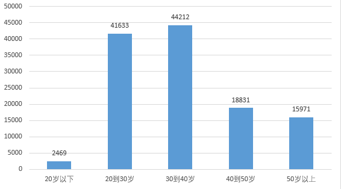

# Airbnb产品数据分析

> 数据处理工具：python
>
> 图像绘制工具：power bi

## 1.背景

**Airbnb**是一个旅行房屋租赁社区，用户可通过网络或手机应用程序发布、搜索度假房屋租赁信息并完成在线预定程序。 据官网显示 以及媒体报道 ，其社区平台在191个国家、65,000个城市为旅行者们提供数以百万计的独特入住选择，不管是公寓、别墅、城堡还是树屋。 **Airbnb**被时代周刊称为“住房中的EBay”。

## 2.分析目的

根据AARRR模型，从以下角度分析问题：

Acquisition：用户群特征有哪些？如何获取更多用户？

Activation：用户激活率是多少？用户激活漏斗模型。

Retention ：留存及复购情况如何？

Revenue/Refer：营销渠道的推广效果如何？当前转化率是多少？

## 3.数据来源

### 来源：

[数据来自来自kaggle](https://www.kaggle.com/c/airbnb-recruiting-new-user-bookings/data)

### 预览：

```python
import numpy as np
import pandas as pd
```

```python
#读取数据并把date_account_created转换为datetime类型
basic_path = r"D:\github\数据集\Airbnb产品"
train_users_df = pd.read_csv(basic_path + r'\train_users.csv',parse_dates=['date_account_created'])
#sessions_df = pd.read_csv(basic_path + r'\sessions.csv')
print(train_users_df.head())
```

```
  id date_account_created  timestamp_first_active date_first_booking  \
0  gxn3p5htnn           2010-06-28          20090319043255                NaN   
1  820tgsjxq7           2011-05-25          20090523174809                NaN   
2  4ft3gnwmtx           2010-09-28          20090609231247         2010-08-02   
3  bjjt8pjhuk           2011-12-05          20091031060129         2012-09-08   
4  87mebub9p4           2010-09-14          20091208061105         2010-02-18   

      gender   age signup_method  signup_flow language affiliate_channel  \

0  -unknown-   NaN      facebook            0       en            direct   
1       MALE  38.0      facebook            0       en               seo   
2     FEMALE  56.0         basic            3       en            direct   
3     FEMALE  42.0      facebook            0       en            direct   
4  -unknown-  41.0         basic            0       en            direct   

  affiliate_provider first_affiliate_tracked signup_app first_device_type  \
0             direct               untracked        Web       Mac Desktop   
1             google               untracked        Web       Mac Desktop   
2             direct               untracked        Web   Windows Desktop   
3             direct               untracked        Web       Mac Desktop   
4             direct               untracked        Web       Mac Desktop   

  first_browser country_destination  
0        Chrome                 NDF  
1        Chrome                 NDF  
2            IE                  US  
3       Firefox               other  
4        Chrome                  US  
```

| 数据表：train_users     | 含义                                           |
| ----------------------- | ---------------------------------------------- |
| id                      | 用户ID                                         |
| date_account_created    | 帐户创建日期                                   |
| date_first_booking      | 首次预订的日期                                 |
| gender                  | 性别                                           |
| age                     | 年龄                                           |
| signup_method           | 注册方式                                       |
| signup_flow             | 用户注册的页面                                 |
| language                | 语言偏好                                       |
| affiliate_channel       | 营销方式                                       |
| affiliate_provider      | 营销来源，例如google，craigslist，其他         |
| first_affiliate_tracked | 在注册之前，用户与之交互的第一个营销广告是什么 |
| signup_app              | 注册来源                                       |
| first_device_type       | 注册时设备的类型                               |
| first_browser           | 注册时使用的浏览器名称                         |
| country_destination     | 目的地国家                                     |

| 数据表sessions | 含义                    |
| -------------- | ----------------------- |
| user_id        | 与users表中的“id”列连接 |
| action         | 埋点名称                |
| action_type    | 操作事件的类型          |
| action_detail  | 操作事件的描述          |
| device_type    | 此次会话所使用的设备    |

## 4.数据清洗

### 缺失值查看

```
train_users_df.isnull().sum()
```

```python
id                              0
date_account_created            0
timestamp_first_active          0
date_first_booking         124543
gender                          0
age                         87990
signup_method                   0
signup_flow                     0
language                        0
affiliate_channel               0
affiliate_provider              0
first_affiliate_tracked      6065
signup_app                      0
first_device_type               0
first_browser                   0
country_destination             0
dtype: int64
```

date_first_booking，age，first_affiliate_tracked三列含有缺失值。

### 异常值查看

```python
train_users_df.describe()
```

<table border="1" class="dataframe">
  <thead>
    <tr style="text-align: right;">
      <th></th>
      <th>timestamp_first_active</th>
      <th>age</th>
      <th>signup_flow</th>
    </tr>
  </thead>
  <tbody>
    <tr>
      <th>count</th>
      <td>2.134510e+05</td>
      <td>125461.000000</td>
      <td>213451.000000</td>
    </tr>
    <tr>
      <th>mean</th>
      <td>2.013085e+13</td>
      <td>49.668335</td>
      <td>3.267387</td>
    </tr>
    <tr>
      <th>std</th>
      <td>9.253717e+09</td>
      <td>155.666612</td>
      <td>7.637707</td>
    </tr>
    <tr>
      <th>min</th>
      <td>2.009032e+13</td>
      <td>1.000000</td>
      <td>0.000000</td>
    </tr>
    <tr>
      <th>25%</th>
      <td>2.012123e+13</td>
      <td>28.000000</td>
      <td>0.000000</td>
    </tr>
    <tr>
      <th>50%</th>
      <td>2.013091e+13</td>
      <td>34.000000</td>
      <td>0.000000</td>
    </tr>
    <tr>
      <th>75%</th>
      <td>2.014031e+13</td>
      <td>43.000000</td>
      <td>0.000000</td>
    </tr>
    <tr>
      <th>max</th>
      <td>2.014063e+13</td>
      <td>2014.000000</td>
      <td>25.000000</td>
    </tr>
  </tbody>
</table>

age 的最大值是2014，不符合常识，猜测错把出生日期当成年龄填入，需要处理掉。将年龄数据小于0大于100的数据修改为 -1,转换数据为int型，方便后续分类统计。

```python
train_users_df.loc[(pd.isnull(train_users_df['age']))|(train_users_df['age']>100),'age']= -1
train_users_df['age'] = train_users_df['age'].astype('int')
```

### 重复值查看

根据数据要求，表中id应唯一，对key：id 进行去重。

```python
train_users_df = train_users_df.drop_duplicates(subset=['id'],keep='first')
```

## 5.数据分析

### 5.1用户画像分析

1. 性别分布

   ```python
   gender_df = train_users_df[(train_users_df['gender']=='FEMALE')|(train_users_df['gender']== 'MALE')].groupby(by = 'gender').size()
   ```

   | 性别   | 人数  |
   | ------ | ----- |
   | FEMALE | 63041 |
   | MALE   | 54440 |

   

   可以看出总样本数据中，女性人数占比略高于男性，产品受女性欢迎度较高。

   

2. 年龄分布

   ```python
   def change_age(age):
       if age >0 and age <=20:
           return "20岁以下"
       elif age >20 and age <=30:
           return "20到30岁"
       elif age >30 and age <=40:
           return "30到40岁"
       elif age >40 and age <=50:
           return "40到50岁"
       elif age >50 and age <=100:
           return "50岁以上"
           
   age_df = train_users_df.copy()
   age_df['age'] = age_df["age"].apply(lambda x:change_age(x))
   age_df = age_df.groupby("age").size()
   ```

   | 年龄     | 人数  |
   | -------- | ----- |
   | 20岁以下 | 2469  |
   | 20到30岁 | 41633 |
   | 30到40岁 | 44212 |
   | 40到50岁 | 18831 |
   | 50岁以上 | 15971 |

   

   由直方图可以看出，主要用户群体集中在20-40岁人群，20岁以下群体可能由于资金因素，消费人群最少

   

3. 使用语言分布

   ```python
   language_df = train_users_df.groupby('language').size().sort_values(ascending=False)
   ```

   | 语言 | 人数   |
   | ---- | ------ |
   | en   | 206314 |
   | zh   | 1632   |
   | fr   | 1172   |
   | es   | 915    |
   | ko   | 747    |
   | de   | 732    |
   | it   | 514    |
   | ru   | 389    |
   | pt   | 240    |
   | ja   | 225    |
   | sv   | 122    |
   | nl   | 97     |
   | tr   | 64     |
   | da   | 58     |
   | pl   | 54     |
   | cs   | 32     |
   | no   | 30     |
   | th   | 24     |
   | el   | 24     |
   | id   | 22     |
   | hu   | 18     |
   | fi   | 14     |
   | is   | 5      |
   | ca   | 5      |
   | hr   | 2      |

   

   - airbnb产品很国际化，用户遍布多个地区。

   - 有超过90%的用户是英语国家（欧美）；airbnb是2013年开始进入中国市场的（此数据集止于2014年），所以此时中文用户数量虽然排名第二，但是占比却非常小。

     

4. 国家目的地分布

   ```python
   country_df = train_users_df[train_users_df['country_destination'] != 'NDF'].groupby('country_destination').size().sort_values(ascending=False)
   ```

   | 国家  | 人数  |
   | ----- | ----- |
   | US    | 62376 |
   | other | 10094 |
   | FR    | 5023  |
   | IT    | 2835  |
   | GB    | 2324  |
   | ES    | 2249  |
   | CA    | 1428  |
   | DE    | 1061  |
   | NL    | 762   |
   | AU    | 539   |
   | PT    | 217   |

   

   客户预定民宿地主要集中在美国，其次是法国意大利德国等。

   

5. 注册app来源分布

   ```python
   sign_app_df = train_users_df[train_users_df['signup_app'] != 'NDF'].groupby('signup_app').size().sort_values(ascending=False)
   
   web_device_type_df = train_users_df[train_users_df['signup_app'] == 'Web'].groupby('first_device_type').size().sort_values(ascending=False)
   ```

   | 方式    | 人数   |
   | ------- | ------ |
   | Web     | 182717 |
   | iOS     | 19019  |
   | Moweb   | 6261   |
   | Android | 5454   |

   | web细分            | 人数  |
   | ------------------ | ----- |
   | Mac_Desktop        | 86839 |
   | Windows_Desktop    | 70887 |
   | iPad               | 13033 |
   | Other/Unknown      | 4773  |
   | iPhone             | 4050  |
   | Desktop_(Other)    | 1145  |
   | Android_Tablet     | 1096  |
   | Android_Phone      | 842   |
   | SmartPhone_(Other) | 52    |

   

   - web端浏览量占比86%，其中web端桌面应用占比接近90%，表明大多数用户喜欢用桌面网页端浏览，可能是因为桌面web端访问方便，数据丰富，选择民宿风格，查看地理位置方便。另一个可能的原因是2014年智能手机还没有像现在一样十分普遍。
   - 使用苹果设备的用户数量大于使用其他设备的用户数量。

### 5.2流量分析

1. 用户量变化

   ```
   train_users_df['year_month'] = train_users_df['date_account_created'].apply(lambda x : x.strftime('%Y-%m'))
   account_crea_df = train_users_df.groupby("year_month").size()
   ```

   > 篇幅所限，节选10行数据

   | 时间    | 人数 |
   | ------- | ---- |
   | 2010-01 | 61   |
   | 2010-02 | 102  |
   | 2010-03 | 163  |
   | 2010-04 | 157  |
   | 2010-05 | 227  |
   | 2010-06 | 222  |
   | 2010-07 | 307  |
   | 2010-08 | 312  |
   | 2010-09 | 371  |

   

- airbnb的用户增长曲线健康，前期（2011年之前）平缓，2012年2月之后开始快速增长。

- 2012年之后的增长速度很快。

- 此产品新用户的增加**存在季节性规律**：每年的7～10月，产品都会迎来用户增长的高峰，推测为夏季是旅行的旺季，而短租产品本身就是旅行消费的一种。

  

2.渠道转化

```python
af_prv_df = train_users_df[(train_users_df['date_first_booking'].notnull())].groupby(['affiliate_channel','affiliate_provider']).size().to_frame()
af_prv_df_1 = train_users_df.groupby(['affiliate_channel','affiliate_provider']).size().to_frame()
af_prv_df = af_prv_df.merge(af_prv_df_1, how='inner', left_index=True , right_index=True).reset_index()
af_prv_df.columns = ['channel','provider','渠道预定数量','渠道全部数量']
af_prv_df = af_prv_df[af_prv_df['渠道预定数量'] > 200]
af_prv_df['类型'] = af_prv_df['channel'] + '-' + af_prv_df['provider']
af_prv_df['占比'] = af_prv_df['渠道预定数量'] /af_prv_df['渠道全部数量']
```

| 类型                 | 渠道预定数量 | 渠道全部数量 | 占比  |
| -------------------- | ------------ | ------------ | ----- |
| seo-google           | 2739         | 5691         | 48.1% |
| other-craigslist     | 1616         | 3471         | 46.6% |
| seo-facebook         | 724          | 1677         | 43.2% |
| direct-direct        | 59234        | 137426       | 43.1% |
| sem-brand-google     | 10705        | 25069        | 42.7% |
| other-other          | 1508         | 3656         | 41.2% |
| sem-brand-bing       | 375          | 950          | 39.5% |
| sem-non-brand-google | 6516         | 16947        | 38.4% |
| api-other            | 2785         | 8167         | 34.1% |
| remarketing-google   | 368          | 1094         | 33.6% |
| sem-non-brand-bing   | 296          | 889          | 33.3% |
| other-padmapper      | 252          | 768          | 32.8% |
| sem-non-brand-vast   | 271          | 829          | 32.7% |
| content-google       | 451          | 2892         | 15.6% |


- 在所有渠道转化中，绝大多数渠道的转化率都超过了30%，整体转化情况良好。

- content_google的转化率异常，明显低于转化率的均值。需要查看哪里出现问题。

- drict（直接应用市场下载注册）的注册量最多，占总注册量的64.38%。我们的分析目的是查看推广渠道的好坏，具体分析中排除了drict。

- sem（谷歌竞价）整体的表现要远好于其他营销方式，前两种sem的营销方式，无论是带来的用户量,注册量及转化率都好于其他营销方式。

- 渠道注册量符合二八定律，前7个渠道的注册量已经占据了产品总的渠道来源的90%以上。

  

  **优质渠道**

  - seo_google的注册量和转化率表现都很好。
  - sem_brand_google的注册量和转化率表现很好。

  

3.营销广告转化

```python
first_aff_trac_df = train_users_df[(train_users_df['date_first_booking'].notnull())].groupby(['first_affiliate_tracked']).size().to_frame()
first_aff_trac_df_1 = train_users_df.groupby(['first_affiliate_tracked']).size().to_frame()
first_aff_trac_df = first_aff_trac_df.merge(first_aff_trac_df_1, how='inner', left_index=True , right_index=True).reset_index()
first_aff_trac_df.columns = ['营销广告来源','该来源预定人数','该来源全部人数']
#first_aff_trac_df = first_aff_trac_df[first_aff_trac_df['渠道预定数量'] > 200]
#first_aff_trac_df['类型'] = first_aff_trac_df['channel'] + '-' + first_aff_trac_df['provider']
first_aff_trac_df['占比'] = first_aff_trac_df['该来源预定人数'] /first_aff_trac_df['该来源全部人数']
first_aff_trac_df = first_aff_trac_df[first_aff_trac_df['营销广告来源'] != 'untracked']
```

| 营销广告来源  | 该来源预定人数 | 该来源全部人数 | 占比  |
| ------------- | -------------- | -------------- | ----- |
| marketing     | 63             | 139            | 45.3% |
| linked        | 20102          | 46287          | 43.4% |
| omg           | 16425          | 43982          | 37.3% |
| tracked-other | 2290           | 6156           | 37.2% |
| product       | 542            | 1556           | 34.8% |
| localops      | 9              | 34             | 26.5% |


- linked推广内容带来的用户转化率和流量都很高，可以后期进行重点推广。
- marking带来的流量较少，但是转化率最高，可以进行重点推广。
- 'product'及'localops'排在所有营销内容的最后两名，带来的流量及转化量都不是很理想，后续可以较少相关资源的配比。


4.转化量漏斗分析

```python
#总用户量
total_user_df = sessions_df.drop_duplicates('user_id')
#定义用户在平台操作次数超过10次即为活跃用户。
#活跃用户数
n_df = sessions_df[['user_id','action_detail']].merge(train_users_df[['id','date_account_created']],how = 'left',left_on = 'user_id',right_on = 'id')
n_df = n_df.groupby('user_id').size().to_frame().reset_index()
n_df.columns = ['user_id','num']
n_df = n_df[n_df['num']>10]
#注册用户数
user_creat_df = total_user_df[['user_id','action_detail']].merge(train_users_df[['id','date_account_created']],how = 'left',left_on = 'user_id',right_on = 'id')
#注册用户中提交过订单信息的用户数
place_order_df = user_creat_df[user_creat_df['date_account_created'].notnull()]
place_order_df = sessions_df[sessions_df['action_detail'] == 'reservations'].groupby('user_id').size()
#注册用户中成功支付的用户数
place_order_df = user_creat_df[user_creat_df['date_account_created'].notnull()]
place_order_df = sessions_df[sessions_df['action_detail'] == 'payment_instruments'].groupby('user_id').size()
#重复购买用户数
re_pay_user_df = place_order_df.to_frame().reset_index()
re_pay_user_df.columns = ["user_id","num"]
re_pay_user_df = re_pay_user_df[re_pay_user_df['num'] > 1]
	
```

| 类别             | 人数   |
| ---------------- | ------ |
| 总用户量         | 135484 |
| 活跃用户数       | 111977 |
| 注册用户数       | 73815  |
| 提交订单用户数   | 10366  |
| 成功支付的用户数 | 9018   |
| 重复购买用户数   | 4153   |


- 注册用户到下单用户是airbnb转化漏斗中流失率最高的一个环节。仅有14.04%的注册用户下单。

- 活跃和复购环节表现的好，其中有46.05%的下单用户复购，说明在商品质量和后续服务比较吸引用户。

- 提交订单的用户中有大约13%的用户没有最终支付，需要查找原因。

  

## 6.总结

- 用户性别中，女性用户多于男性用户，但是差别不大。用户年龄以中青年为主。用户分布地区最多的为欧美地区，其次是中国，但欧美占比达到了90%以上。
- 此产品新用户的增加存在季节性规律：每年的7～10月，产品都会迎来用户增长的高峰。
- 直连用户的注册量最多，占总注册量的64.38%。注册量排名前6的渠道，占据了产品全部渠道注册来源数量的90%以上。
- 主要渠道中，content_google的转化率异常，明显低于转化率的均值。
- airbnb转化漏斗中流失率最高的一个环节是“用户下单”，仅有14%的注册用户下单。下单用户中有大约13%的用户最终没有支付成功。活跃和复购环节表现良好，产品质量和后续服务做的比较好。

## 7.建议

1. 根据年龄分布特征，建议SEO或者付费广告投放时，投放对象细化至年龄在29～39岁的男性。
2. 7～10月是业务的旺季，建议运营部门在每年的7～10月加大活动营销的力度，同时加大渠道广告的投放力度。
3. 在主要渠道中content_google只有15%，建议运营部门计算此渠道的ROI和ARPU，如果ROI > ARPU，建议停止此渠道的投放。
4. SEO推广下各渠道的拉新和转化都好，SEO作为一种较低成本的获客方式，建议企业管理层日常要更加支持SEO相关的资源投入，甚至考虑扩大SEO的团队。
5. 不通营销内容的拉新和转化效果也不同，优秀营销内容（linked）和表现较差的营销内容（localops），如果在活动过程建议对localops及时优化内容甚至更换。如果是活动之后、建议运营部门针对不同质量的营销内容做对比分析。
6. 注册用户到下单用户是airbnb转化漏斗中流失率最高的一个环节，仅有14%的注册用户真正下单，此环节作为企业营收的主要来源之一，建议围绕提高下单率做更多的工作。例如针对活跃用户的用户轨迹定期推送（产品push，短信邮件）优质房源。
7. 下单用户中有大约13%的用户最终没有支付，需要排查具体原因，建议进行用户调研、或者在产品上统计用户未支付原因（是用户自身决策导致、还是产品流程的原因、还是支付类型不满足个别地区等）。