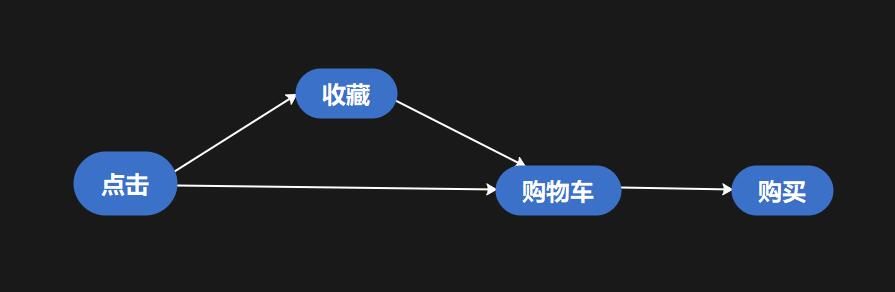
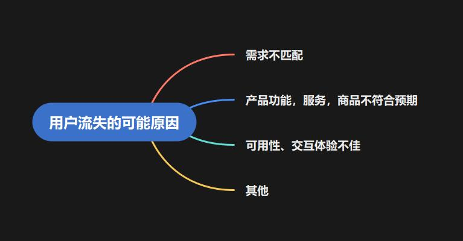

# 淘宝用户行为分析

## 1.数据描述

[数据来源](https://tianchi.aliyun.com/dataset/dataDetail?dataId=649&userId=1)

| 文件名称         | 说明                   | 包含特征                                     |
| ---------------- | ---------------------- | -------------------------------------------- |
| UserBehavior.csv | 包含所有的用户行为数据 | 用户ID，商品ID，商品类目ID，行为类型，时间戳 |


本数据集包含了2017年11月25日至2017年12月3日之间，有行为的约一百万随机用户的所有行为（行为包括点击、购买、加购、喜欢）。数据集共3.4G。数据集的组织形式和MovieLens-20M类似，即数据集的每一行表示一条用户行为，由用户ID、商品ID、商品类目ID、行为类型和时间戳组成，并以逗号分隔。关于数据集中每一列的详细描述如下：


| 列名称     | 说明                                               |
| :--------- | :------------------------------------------------- |
| 用户ID     | 整数类型，序列化后的用户ID                         |
| 商品ID     | 整数类型，序列化后的商品ID                         |
| 商品类目ID | 整数类型，序列化后的商品所属类目ID                 |
| 行为类型   | 字符串，枚举类型，包括('pv', 'buy', 'cart', 'fav') |
| 时间戳     | 行为发生的时间戳                                   |

## 2.数据处理

```python
import pandas as pd
import numpy as np
from pprint import pprint
import os
```

```python
def list_dir_files(root_dir, ext=None):
    names_list = []
    paths_list = []
    for parent, _, fileNames in os.walk(root_dir):
        for name in fileNames:
            if name.startswith('.'):  
                continue
            if ext:  
                if name.endswith(tuple(ext)):
                    names_list.append(name)
                    paths_list.append(os.path.join(parent, name))
            else:
                names_list.append(name)
                paths_list.append(os.path.join(parent, name))
    #paths_list, names_list = sort_two_list(paths_list, names_list)
    #return paths_list, names_list
    return paths_list,names_list


Raw_data_df = pd.DataFrame(columns = ['用户ID', '商品ID','商品类目ID','行为类型','时间戳'])

for path in list_dir_files(r'D:\github\数据集\淘宝用户行为数据分析',"csv")[0]:
    try:
        df = pd.read_csv(path, names=['用户ID', '商品ID','商品类目ID','行为类型','时间戳'])
        #df = df.loc[(df['时间戳'] > 1511539200 ) & (df['时间戳'] <= 1512316799)]       
        df = df.sample(frac=0.1, replace=True, random_state=1)
        Raw_data_df = Raw_data_df.append(df)
    except :
        print("load file error")
```

```
#查看数据基本信息
print(Raw_data_df.info())
print(Raw_data_df.isnull().sum())
```

| Column     | dtype  | sum  |
| ---------- | ------ | ---- |
| 用户ID     | object | 0    |
| 商品ID     | object | 0    |
| 商品类目ID | object | 0    |
| 行为类型   | object | 0    |
| 时间戳     | object | 0    |

数据完整，没有缺失。接下来转换时间戳为可读取时间（注意时区的问题）

```
Raw_data_df['时间'] = pd.to_datetime(Raw_data_df['时间戳'], unit='s').dt.tz_localize('UTC').dt.tz_convert('Asia/Shanghai').dt.date.astype(str)
Raw_data_df['时段'] = pd.to_datetime(Raw_data_df['时间戳'], unit='s').dt.tz_localize('UTC').dt.tz_convert('Asia/Shanghai').dt.hour.astype(int)
```

| 用户ID | 商品ID  | 商品类目ID | 行为类型 | 时间戳     | 时间       | 时段 |
| ------ | ------- | ---------- | -------- | ---------- | ---------- | ---- |
| 278465 | 1449655 | 3299155    | pv       | 1512045603 | 2017/11/30 | 20   |
| 29532  | 1669735 | 3138705    | pv       | 1512170704 | 2017/12/2  | 7    |
| 260458 | 1832285 | 4756105    | pv       | 1512258051 | 2017/12/3  | 7    |
| 105887 | 742386  | 2495340    | pv       | 1512198013 | 2017/12/2  | 15   |
| 311157 | 3902816 | 154040     | pv       | 1511838526 | 2017/11/28 | 11   |
| 275899 | 1318065 | 200278     | cart     | 1512117539 | 2017/12/1  | 16   |

完成了将时间戳按照上海时间转换，并提取出时段信息，为后续分析做准备。

```python
#查看用户行为是否符合规定：即只有PV，buy，cart，fav 四类
print(Raw_data_df['行为类型'].unique())
#查看原始数据时间跨度
print(Raw_data_df['时间'].min(),Raw_data_df['时间'].max())
```

结果显示用户行为符合规定，即只有规定的4个指标，但是时间跨度不正确，时间跨度从1919-09-19 到 2037-04-09，有超出分析时间范围的数据，要清洗掉。

```python
Raw_data_df=Raw_data_df.loc[(Raw_data_df['时间'] > '2017-11-25') & (Raw_data_df['时间'] <= '2017-12-03')]
```

按照数据集规定，筛选掉2017.11.25到2017.12.03以外时间的数据。

## 3.数据分析

### 用户行为概览

```
#.用户行为概览
user_behav_df = Raw_data_df.groupby(['行为类型'])["用户ID"].nunique()
print(user_behav_df)
#行为类型计数
count = Raw_data_df['行为类型'].value_counts()
#组合表
fin_df = pd.merge(user_behav_df,count,how= 'inner',left_index=True,right_index=True).sort_values("行为类型",inplace=False,ascending=False)
```

| 行为类型 | 用户数 | 操作数  |
| -------- | ------ | ------- |
| pv       | 925642 | 8030436 |
| cart     | 293678 | 497207  |
| fav      | 139287 | 258172  |
| buy      | 145240 | 181685  |

使用plotly绘图如下：

.png)

```python
date_use_df = Raw_data_df.groupby(['时间'])["用户ID"].nunique().to_frame()
date_click_df = Raw_data_df.groupby(['时间']).size().to_frame()
date_use_df.columns = ["用户数"]
date_click_df.columns = ["点击数"]
```

### 用户分布

#### 按日期分类

.png)


11月25日、26日，以及12月2日跟3日，这4天是周末，可以看到不论是从点击次数还是人数上，都要高于中间的5天。而12月初的周末PV量明显增加，可以考虑是否有12月初营销活动的影响。

#### 按时段分类

```
# 分时段点击量和用户访问数
hour_df = Raw_data_df.groupby(['时段'])["用户ID"].nunique().to_frame().sort_index()
```

.png)

可以看到销量高峰是中午10点-15点和晚上20点-22点，最高峰在晚上9点。而低谷出现在夜里1点-6点。这也符合我们的认知，中午休息和睡前是刷淘宝最多的时候。可以考虑在高峰时段，通过广告投放、微信QQ支付宝推广等方式，吸引更多客户。

### 热搜及热销商品

```python
#选取点击量前十的商品类别
commodity_df = Raw_data_df.groupby(['商品类目ID'])["用户ID"].nunique().to_frame().sort_values(by = ["用户ID"],ascending = False).head(10)
commodity_df = commodity_df.reset_index()
print(commodity_df)
commodity_buy_df = Raw_data_df.loc[Raw_data_df["行为类型"] == "buy"].groupby(['商品类目ID'])["用户ID"].nunique().to_frame().sort_values(by = ["用户ID"],ascending = False).head(10)
commodity_buy_df = commodity_buy_df.reset_index()
```

### 用户点击行为转化
淘宝购买流程的主路径为首页——活动页——商品详情页——加入购物车——支付完成。而其中三个关键转化为“UV-点击”、“点击-加入购物车”、“购物车-支付成功”。由于数据集中只记载了用户点击、加入购物车等行为，我们无法统计“UV-点击”这一步的转化率，所以重点关注后两者的转化率。



#### 转化率分析

```
fin_new_df = fin_df.copy().reset_index()
fin_new_df.columns = ["行为类型","用户数","点击数"]
fig = go.Figure(go.Funnel(
    y = fin_new_df['行为类型'] ,
    x = fin_new_df['点击数'],
    textposition = "outside",
    textinfo = "value+percent initial",
    opacity = 0.65, marker = {"color": ["deepskyblue", "lightsalmon", "tan", "teal", "silver"],
    "line": {"width": [4, 2, 2, 3, 1, 1], "color": ["wheat", "wheat", "blue", "wheat", "wheat"]}},
    connector = {"line": {"color": "royalblue", "dash": "dot", "width": 3}})
    )

layout = dict(
            autosize=False,
            width=1500/16*9,
            height=1500,
    )
fig['layout'].update(layout)

fig.show()
```

.png)

可以看到在“点击-加入购物车”这一环节流失严重，转化率仅为6.2%。但透过数据仔细思考一下，一般买东西总是要货比三家的，即使每个浏览淘宝的人都最终完成了购买，照这样计算转化率也不会是100%。假如平均每人购买前浏览5个商品详情页，那么转化率最高也只有20%。而浏览更多的商品详情页是商家希望看到的，这样可以提高用户的平均浏览时间，也能看到更多商品和广告。故该转化率模型还需要继续优化

#### **用户流失的可能原因**



```
l_df = Raw_data_df.reset_index()[['用户ID','行为类型']]
l_df = l_df.groupby(['用户ID','行为类型']).size().unstack().fillna(0).astype(int)[['pv','cart']]
df = px.data.iris()
fig = px.scatter(l_df, x="pv", y="cart")
fig.show()
```

.png)

#### **用户需求匹配分析**

想要了解用户需求，我们需要首先对用户进行分类从而更精准地匹配不同人群的需求，对于“点击-加入购物车”这一步骤，我们试图总结典型用户的不同行为特点。

1.第一类是优质客户，位于图片的右上方，他们的特点应该是PV很高同时加入购物车次数也很多的用户，这部分用户数量不多，但却是淘宝的最优质用户，我们要做的就是继续保持他们旺盛的购物欲。

2.第二类是购物目标明确地客户，位于图片左上方，他们PV不高但加入购物车次数很多的用户。这部分用户逛淘宝时目标明确,对于这类用户我们应该提供精准的推荐吸引他们继续浏览商品，从而提高他们在淘宝的浏览时间和PV，进一步提升他们的成交率和购物篮系数。

3.第三类客户是不活跃用户，位于原点附近，较少浏览商品也很少加入购物车，甚至很多人在这9天里从未将商品加入购物车。对于这部分用户，我们需要用搞活动、做宣传等方式吸引他们更多地参与到线上购物中来，提升他们的网购积极性。

4.第四类用户是很少下单的用户，位于图片的右下方。这部分人数量不多，但需要我们重点关注。是什么原因导致他们频繁浏览却不加入购物车呢，很可能是因为没有找到自己满意的商品，他们积极地寻找想买的商品却发现没有商品满足自己的需求。对于这部分用户我们需要从商品的角度考虑要如何满足他们的需求，是价格带设置不合理还是商品种类不够丰富？或者推荐机制出了问题导致没有把最合适的商品推到他们面前？

## 总结

1.由于本次分析，是从源数据当中随机抽取了约10%的数据，所以结果仅能作为参考，后续可以考虑重复此筛选过程，比如随机抽取10次，观察结果偏差存在偏差；

2.用户每晚21点左右，活跃程度达到峰值，可考虑在此时段，定点推广，吸引更多客户消费；

3.用户点击最多的商品，与购买数量并不呈现明显相关性，是否可以考虑网站的推荐算法，可以继续优化，加之本数据没有用户性别、收入、职业、年龄等关键因素，因此暂不能对用户画像进行分析比较；

4.用户的点击到购买，转化率非常低，而用户加购物车及收藏后转化率明显上升不少，因此后续的推广活动，可以从吸引客户种草方面去考虑。

5.从用户需求的角度对用户分组之后，发现有部分用户浏览量很大但下单数很少，这部分用户有强烈的购买需求但淘宝没有满足他们的需求，很可能是他们没有找到合适的商品或者淘宝未能展现商品的魅力成功吸引他们，可能的解决方法有对这部分用户使用更合理的推荐算法帮助他们找到心仪的商品，或者改用更具吸引力的商品介绍促使他们下单。